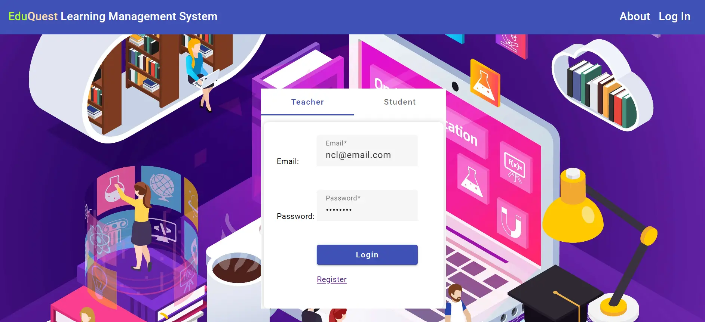
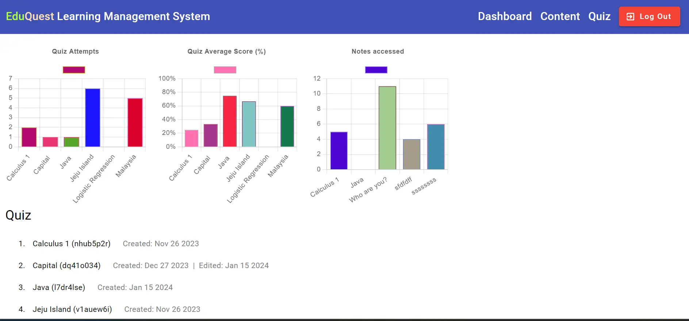
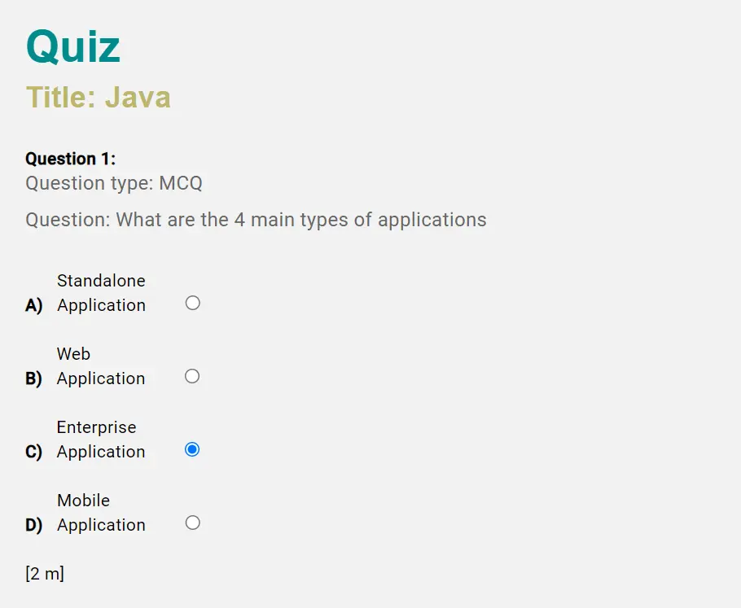

# Learning Management System (LMS) Project

## Overview

EduQuest is a Learning Management System (LMS) designed to facilitate the management and delivery of educational courses. It is built using Angular for the frontend and Spring Boot for the backend, providing a robust and scalable solution for educational institutions.

## Features

- **User Authentication:** Both student and teacher login and registration 
- **Course Management:** Create, edit, and delete courses with ease.
- **Dashboard:** Provide a personalized dashboard for users with relevant information.
- **Responsive Design:** Ensure a seamless experience across various devices.

## Technologies Used

- **Frontend:** Angular
- **Backend:** Spring Boot
- **Database:** (MySQL, MongoDB)
- **REST API:** Follow RESTful principles for communication between frontend and backend.

## Getting Started

### Prerequisites

- Node.js and npm for Angular development.
- Java Development Kit (JDK) for Spring Boot.
- MongoDB and MySQL 

### Installation

1. Clone the repository:

  
   git clone https://github.com/nchinling/learning_management_system.git

### Frontend setup
  
    cd lms-frontent
    npm install
    ng serve
    

### Backend setup
    cd project.backend
    mvn clean spring-boot:run
  
### Video

